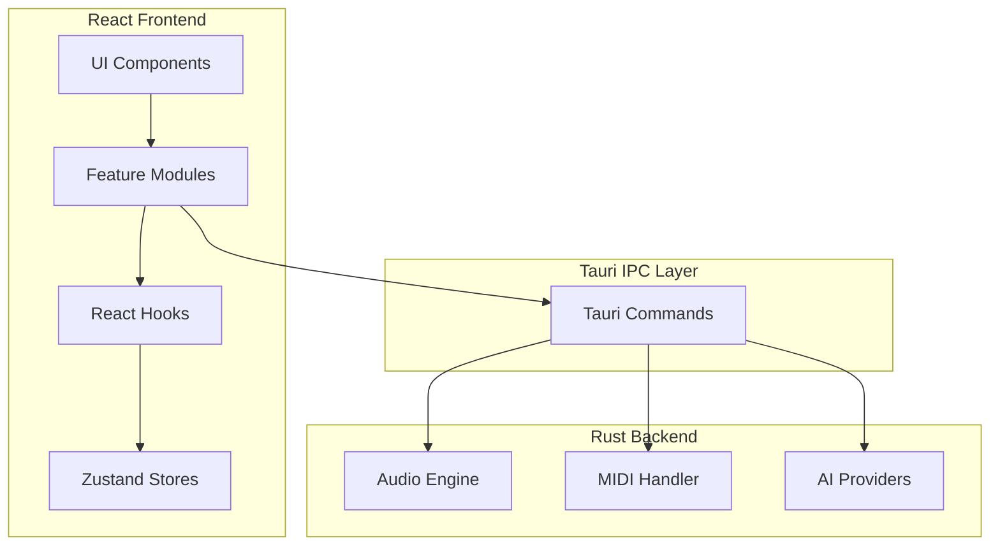
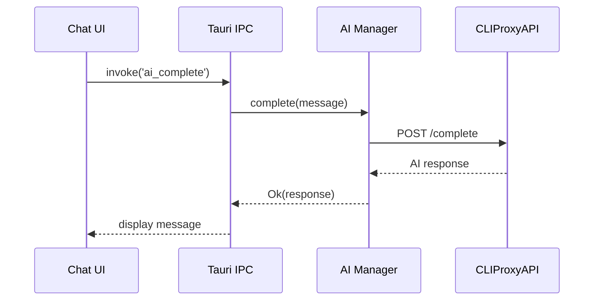

# OpenMusic System Architecture

## High-Level Overview

```
┌─────────────────────────────────────────────────────────────┐
│                     OpenMusic Desktop App                    │
├─────────────────────────────────────────────────────────────┤
│  ┌─────────────────────────────────────────────────────┐   │
│  │                  React Frontend                      │   │
│  │  ┌──────────┐ ┌──────────┐ ┌──────────┐ ┌────────┐ │   │
│  │  │  Lyrics  │ │  Beat    │ │  Audio   │ │   AI   │ │   │
│  │  │  Editor  │ │  Maker   │ │  Player  │ │  Chat  │ │   │
│  │  └──────────┘ └──────────┘ └──────────┘ └────────┘ │   │
│  │                Web Audio API (Visualization)         │   │
│  └─────────────────────────────────────────────────────┘   │
│                           │ IPC                             │
│  ┌─────────────────────────────────────────────────────┐   │
│  │                   Rust Backend                       │   │
│  │  ┌──────────┐ ┌──────────┐ ┌──────────┐ ┌────────┐ │   │
│  │  │  Audio   │ │   MIDI   │ │    AI    │ │ Project│ │   │
│  │  │  Engine  │ │  Engine  │ │ Provider │ │ Manager│ │   │
│  │  └──────────┘ └──────────┘ └──────────┘ └────────┘ │   │
│  └─────────────────────────────────────────────────────┘   │
└─────────────────────────────────────────────────────────────┘
                              │
        ┌─────────────────────┼─────────────────────┐
        ▼                     ▼                     ▼
   ┌─────────┐          ┌─────────┐          ┌─────────┐
   │CLIProxy │          │ Claude  │          │ Local   │
   │  API    │          │ Gemini  │          │  Files  │
   └─────────┘          │ Codex   │          └─────────┘
                        └─────────┘
```

## Mermaid Diagrams

### Component Architecture



### AI Provider Flow



---

## Core Modules

### 1. Audio Engine (Rust)
- **Playback:** rodio for high-level, cpal for low-latency
- **Recording:** cpal input streams
- **Processing:** Separate audio thread, lock-free buffers
- **Format Support:** symphonia (decode), hound (WAV encode)

### 2. MIDI Engine (Rust)
- **I/O:** midir for external controllers
- **File Parsing:** midly for .mid files
- **Sequencer:** Custom timing with Instant

### 3. AI Provider (Rust)
- **Abstraction Layer:** Unified interface for all providers
- **Offline:** Ollama HTTP API (localhost:11434)
- **Cloud:** OpenAI, Claude, Gemini via HTTP
- **Features:** Lyrics, chord suggestions, composition help

### 4. Project Manager (Rust)
- **Storage:** SQLite for metadata
- **Files:** Audio, MIDI, project files on disk
- **Export:** WAV, MP3 (via ffmpeg), MIDI

---

## Frontend Components

### Lyrics Editor
- Rich text editor with verse/chorus structure
- AI suggestions sidebar
- Syllable counter, rhyme helper

### Beat Maker
- Grid-based pattern editor
- Sample library browser
- BPM/time signature controls

### Audio Player
- Waveform visualization (Web Audio AnalyserNode)
- Transport controls (play, pause, seek)
- Volume, pan controls

### AI Chat
- Conversation interface for suggestions
- Provider selector
- History persistence

---

## Data Flow

### Audio Playback
```
User Click → React → IPC invoke('play_audio') → Rust → rodio → Speakers
```

### AI Request
```
User Input → React → IPC invoke('ai_generate') → Rust → Provider → Response → React
```

### Beat Creation
```
Grid Edit → React State → IPC invoke('update_pattern') → Rust → MIDI → Audio Preview
```

---

## File Structure

```
src/                    # React frontend
├── components/         # UI components
├── features/           # Feature modules (lyrics, beats, ai)
├── hooks/              # Custom React hooks
├── stores/             # Zustand stores
└── lib/                # Utilities

src-tauri/              # Rust backend
├── src/
│   ├── audio/          # Audio engine
│   ├── midi/           # MIDI engine
│   ├── ai/             # AI provider abstraction
│   ├── project/        # Project management
│   └── commands/       # Tauri commands
└── Cargo.toml
```

---

## Security

- API keys stored encrypted (tauri-plugin-store)
- No sensitive data in IPC payloads
- Sandboxed file access via Tauri APIs
- Local-first: Offline mode by default
